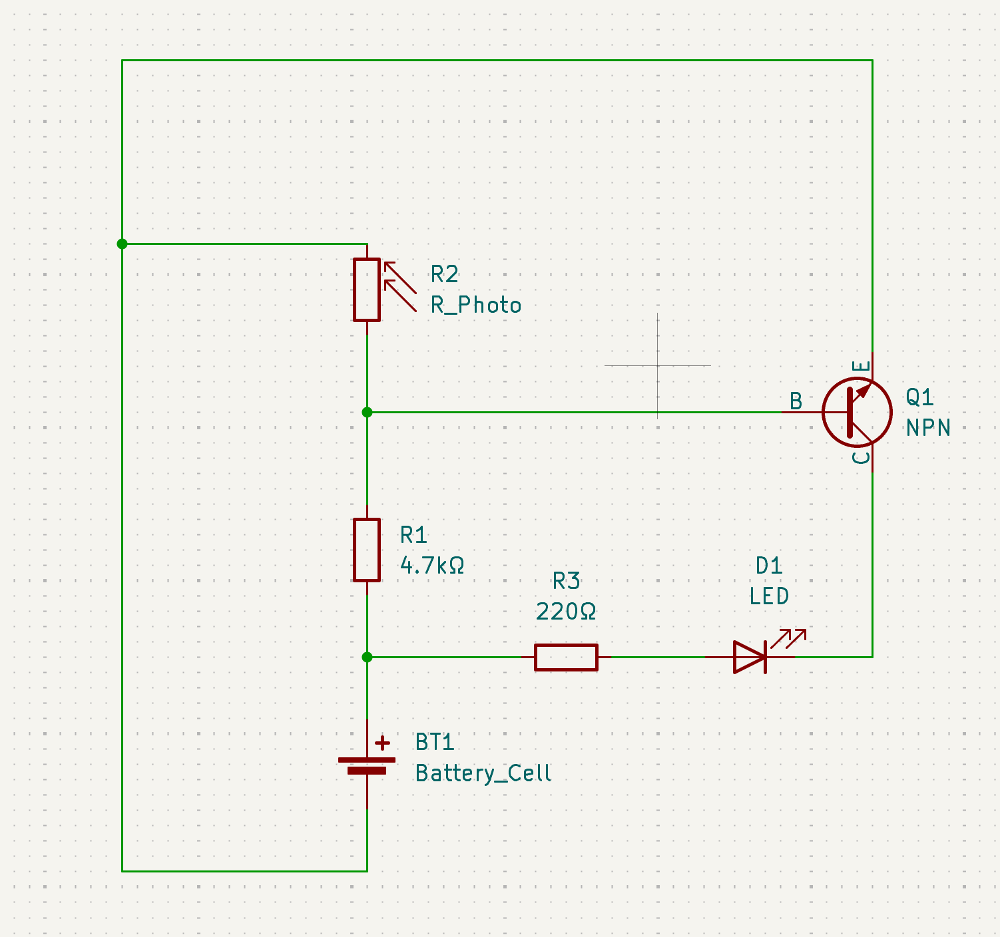
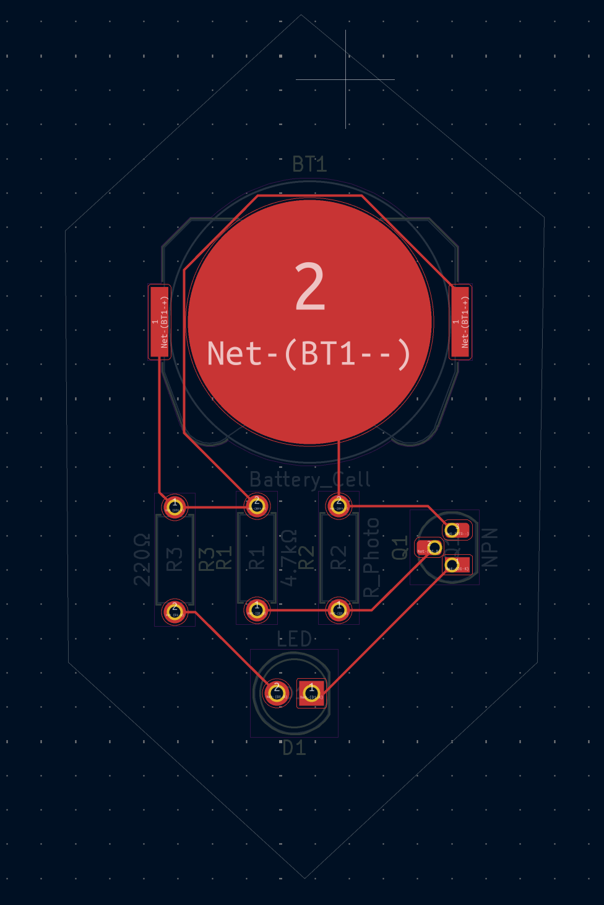
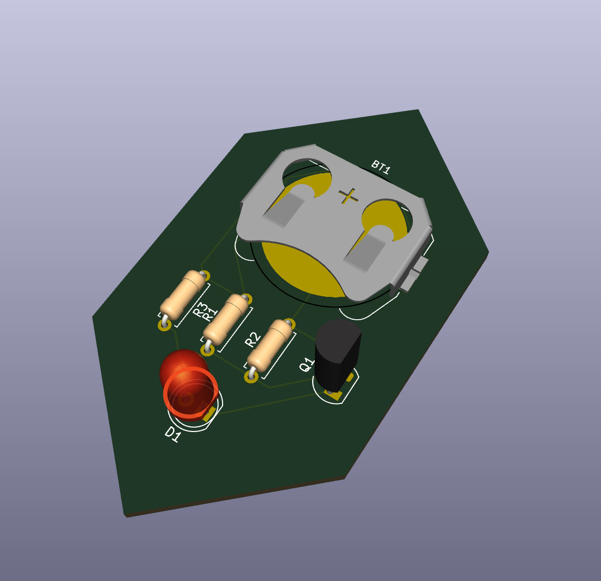

## A Light Controlled Circuit
#### A compact PCB that incorporate a photoresistor in order to dynamically control and LED based on ambient lighting. Created by 
---
### Schematic
---

### PCB
---

### PCB 3D
---

## Bill of Materials
- 1x Battery Holder
- 1x LED
- 1x 220Ω resistor
- 1x 4.7lΩ resistor
- 1x photoresistor
- 1x NPN transistor

Created by @Ryan Latimer on slack.
